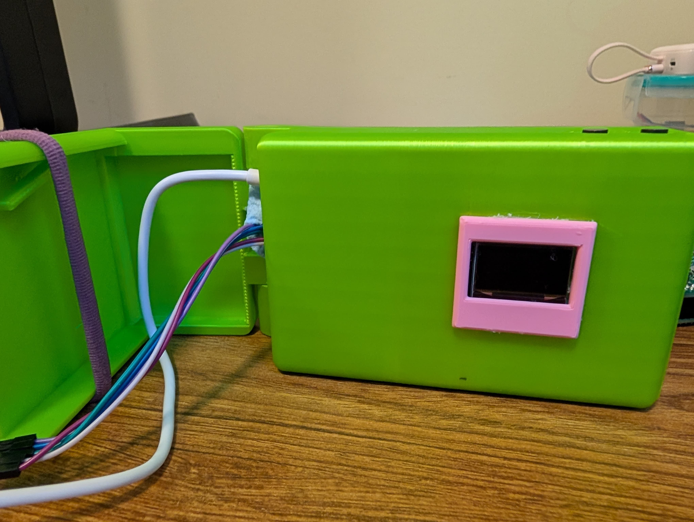
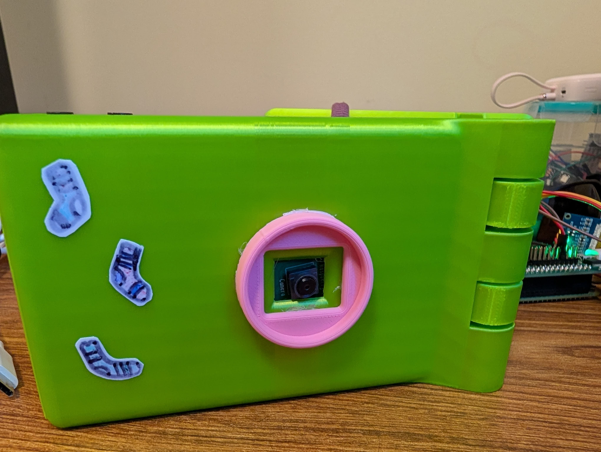
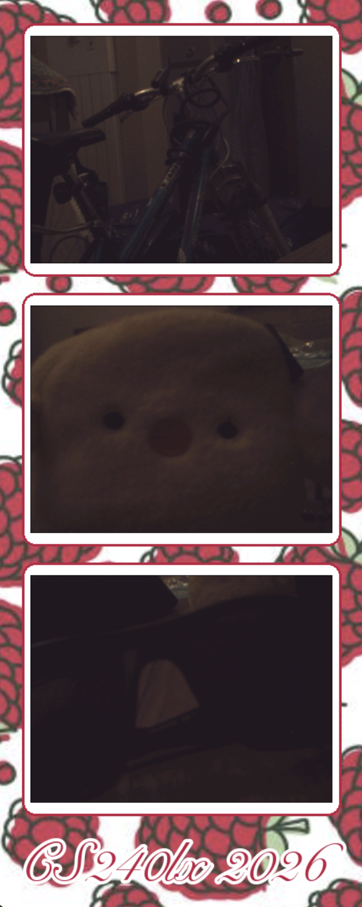
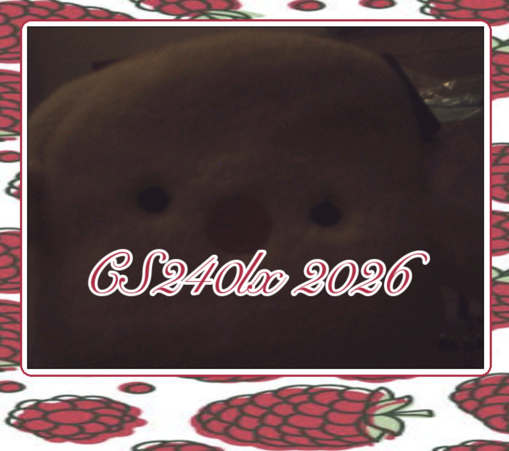
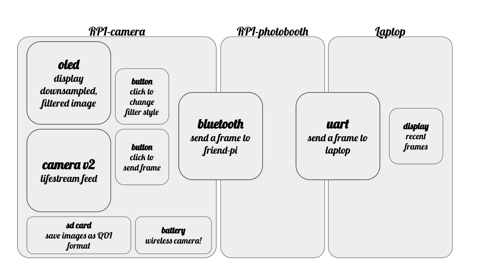

# 🧦 SOCKS 🧦

### Aditi and Christy Capture the World

`path = CS240LX_2026_PROJ_PATH`

## What is this?

TLDR: A bare-metal camera! 🧦📸
One Pi runs the camera + OLED live view (with real-time filters) and sends a captured photo over Bluetooth on a button press; the second Pi bridges Bluetooth, then UART, then a laptop, which renders a cute raspberry-themed photobooth strip. In addition, captures get written in QOI format to an SD card on the camera Pi (FAT32 writes)!

**VIDEO DEMO HERE: https://youtu.be/GY0M7b11RgY**

<p align="center">
  
  
  <!--  -->
</p>

<p align="center">
  
  
  <!--  -->
</p>

## How it all fits together

- **Aditi Pi** ([camera-240lx/src/main_aditi.c](camera-240lx/src/main_aditi.c)): live camera → OLED, four view modes, sends the current color frame over BT on a button press, and saves a downsampled copy to the SD card.
- **Christy Pi** ([camera-240lx/src/main_christy.c](camera-240lx/src/main_christy.c)): no camera/OLED. It just accepts the BT connection and forwards every received byte straight out the UART to the laptop.
- **Laptop** ([camera-240lx/laptop_code/laptop-side-display.py](camera-240lx/laptop_code/laptop-side-display.py)): reads frames off the serial port, renders the photobooth strip, and saves received images at full res to `laptop_code/captured/`.

<p align="center">
  
</p>

## Drivers

* **OLED** (SSD1306)
  * [camera-240lx/src/ssd1306-display-driver.c](camera-240lx/src/ssd1306-display-driver.c), [display.c](camera-240lx/src/display.c)
* **Camera** (IMX219 over Unicam; early OV7670 work)
  * [camera-240lx/src/camera.c](camera-240lx/src/camera.c), [imx219.c](camera-240lx/src/imx219.c), [unicam.c](camera-240lx/src/unicam.c)
  * CSI protocol, sending RAW8
  * Interupt-driven
* **Bluetooth** (BCM43430A1)
  * [camera-240lx/src/bt.c](camera-240lx/src/bt.c), [BCM43430A1.c](camera-240lx/src/BCM43430A1.c)
  * We changed this to use polling (instead of the original interrupt-based driver)
* **FAT32 SD archive** (ported 140e read/write FS, bare metal)
  * [camera-240lx/src/fat32.c](camera-240lx/src/fat32.c), [fat_heap.c](camera-240lx/src/fat_heap.c), [pi-sd.c](camera-240lx/src/pi-sd.c)
  * Images on order of 80KB, saved in QOI format
  * You can see SD-saved images (converted to jpg/png) at camera-240lx/sd_tools

### Other code

* **UART** (sending image data to screen, not just text on terminal)
  * [camera-240lx/src/pl011.c](camera-240lx/src/pl011.c), [pl011_os.c](camera-240lx/src/pl011_os.c), laptop side: [laptop-side-display.py](camera-240lx/laptop_code/laptop-side-display.py)
* **GPIO buttons + debouncing**
  * [camera-240lx/src/button.c](camera-240lx/src/button.c)
* **Image processing**
  * edge detection (Sobel) + frame handling: [camera-240lx/src/main_aditi.c](camera-240lx/src/main_aditi.c), [frame_data.c](camera-240lx/src/frame_data.c)
  * QOI encode for SD archive: [camera-240lx/src/qoi_enc.c](camera-240lx/src/qoi_enc.c). QOI is like the leetcode compression algos you see in coding exams; it uses shorthands to notate repeated pixels and other patterns.
  * metrics (PSNR/SSIM): [camera-240lx/src/img_metrics.c](camera-240lx/src/img_metrics.c); we log some metrics
  * bayer/rgb → jpg: [bayer_to_jpg.py](camera-240lx/bayer_to_jpg.py), [wb_tuner.py](camera-240lx/src/wb_tuner.py)
* **SD Writes**
  * saving images to fat32 on the camera-pi's sd card; the cluster start index was wrong, and then we were saving bytes but it was all 0's. fixed both! saves a real `.QOI` per capture now. (sanity-check it with `make BUILD=sdtest`, which writes + reads back a sweep of file sizes.)
* **Livestream!**
  * livestream: split it into its own build (`make BUILD=live`). We tile the frame into 8×8 blocks and only send the ones that changed significantly vs the last frame, so most frames are tiny. ~10–15fps, sent in color, back to the laptop over BT+UART!! view it using [laptop-side-live.py](camera-240lx/laptop_code/laptop-side-live.py) (display only, no saving). We flash a different kernel to aditi's pi but same to christy's.

## Building & flashing

```bash
make BUILD=both        # build both kernels, no flashing
make BUILD=aditi       # build + flash Aditi's Pi over USB serial
make BUILD=christy     # build + flash Christy's Pi
make BUILD=live        # livestream-only test (Aditi side) — view with laptop-side-live.py
```

### **Buttons + Modes:**

- **MODE SELECT (gpio16)** We cycle the mode from EDGE -> TITLE -> COLOR -> DITHER -> EDGE -> ...
  - Sobel edge detection (3×3 blur prefilter, then downsample); this is the default setting (6FPS; convolves 3x3 with the image prior to downsampling)
  - Title: static "aditi and christy / capture the world" with a pair of socks (15FPS)
  - Color: plain debayered scene (15FPS)
  - Floyd–Steinberg dithering to 1-bit (looks much better than thresholding; we can capture textures and faces quite well with this even on black/white) (15FPS)
- **CAPTURE (gpio26)** captures: sends the current, full res color frame (RGB 565) over BT to the laptop and archives a downsampled `.QOI` to the SD card.

## Hardware

* Custom CAD model to hold display, buttons, and camera ([Onshape](https://cad.onshape.com/documents/dccbd11e94220b0c426c9fce/w/b4ad619e16e452a098de2284/e/75783d83d14b92a884b6b85e?renderMode=0&uiState=6a207f2fba0e0ed3d5f1a163))
* Soldered buttons to communicate with the Pi via GPIO
* Untethered camera which runs on a power supply!

## Image sizes at each stage

| stage                                | resolution                      | bytes        |
| ------------------------------------ | ------------------------------- | ------------ |
| camera / debayer on working buffer   | 640×480 RGB888 (32b/px in RAM) | 1,228,800    |
| BT send (Aditi → Christy → laptop) | 640×480 RGB565 + 20B header    | 614,420      |
| laptop decode / save                 | 640×480 RGB888 PNG             | 921,600 raw  |
| OLED display                         | 128×64 × 1-bit                | 1,024        |
| SD archive (QOI format)              | 320×240, compressed            | ~100–160 KB |

We send **RGB565** over the wire (not RGB888). It halves the payload for ~the same image, and the 20-byte header is `MAGIC | W | H | FORMAT | PAYLOAD_LEN`.

Full images are 640 by 480 pixels, with RGB888 encoding. Downsampled images are 128 by 64 pixels.

## Performance

**Transfer rates (discrete captures, not a continuous stream):**

- **Bluetooth**: the HCI link is 3 Mbaud, but real ACL throughput is **~250 KB/s (~2 Mbit/s) after credit-based flow control + 1020-byte packet framing (4 packets in flight). A 614 KB frame ≈ **~2.5 s**.
- **UART (Christy → laptop)**: **2,840,909 baud**, 8N1 = 10 bits/byte → **~274–284 KB/s** → 614 KB ≈ **~2.2 s**.
- "Laptop fps" for full res image is limited by BT+UART at ~one photo every 2.5–3 s.
- SD writes: 320×240 downsample (~307K ops) + QOI encode (~600K ops). Images are about 80KB each; it depends on how much variation is in the image since QOI compression relates pixels in order to compress

### Timeouts

- **BT timeouts (5 s)**: if a transfer stalls mid-frame, Aditi's send aborts (`SEND TIMEOUT` on the OLED) and Christy drops the partial frame instead of either Pi hanging forever.
- A good frame finishes in ~1–2 s, so 5 s of *silence* means we must have dropped a packet or something

## Contributions

* **Aditi -** OLED, Bluetooth, SD/FAT32 archive, image filters, livestream CAD + soldering
* **Christy** - camera + tuning, battery, UART transfer + laptop display
* **Both** - integration of submodules
* AI statement - We used AI for laptop-side display, learning concepts, code cleanup, and to speed up the integration/optimization process (including livestream and python files). Individual drivers, filters, and features were primarily coded by hand.

Feel free to contact us for more drivers/info! 🍓
